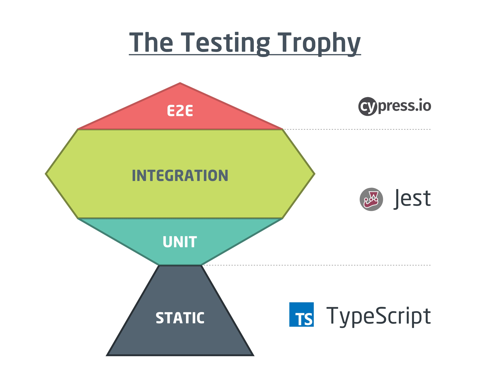
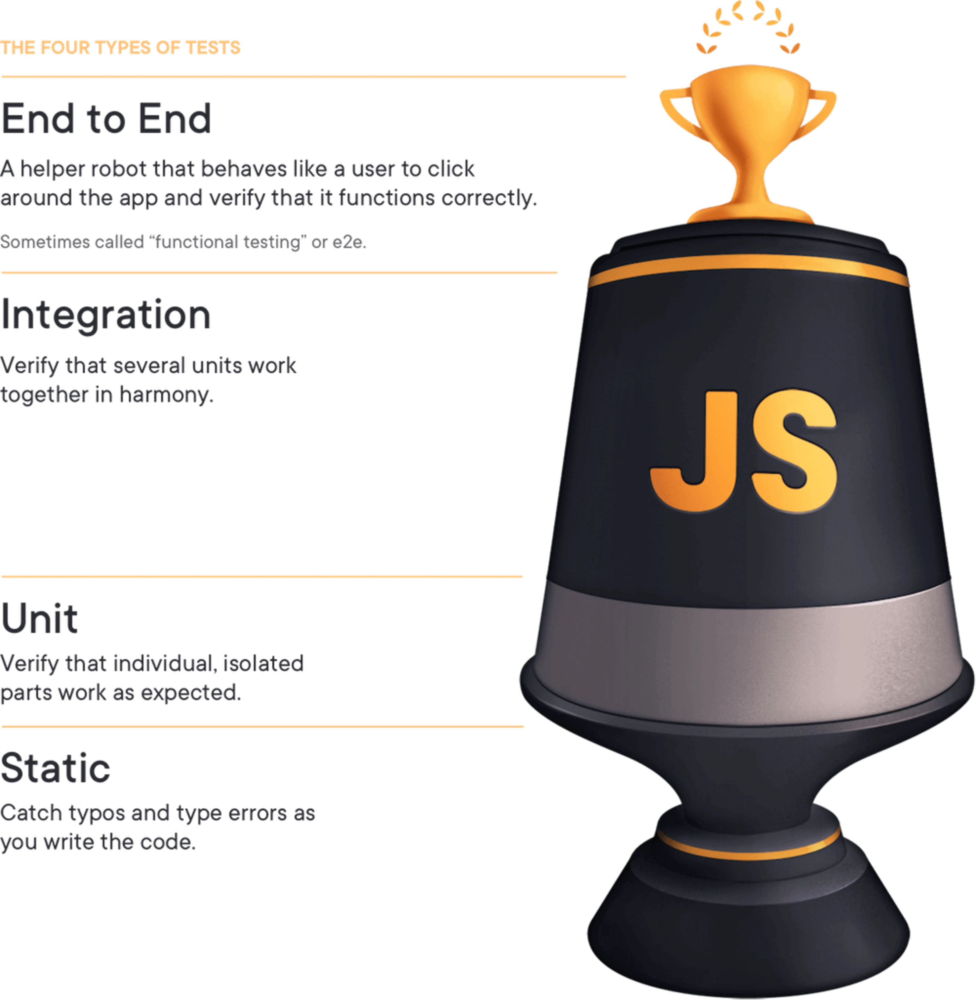

# React Movie App

This is a modern React app bootstrapped with [Vite](https://vitejs.dev/) for fast development, styled with [Tailwind CSS](https://tailwindcss.com/), and tested using [Vitest](https://vitest.dev/).

## 🛠 Tech Stack

- **Vite** – Lightning-fast bundler and dev server
- **React** – Component-based UI library
- **Tailwind CSS** – Utility-first CSS framework
- **Vitest** – Unit testing framework (Jest-compatible)
- **Jest** –
- **jsdom** – Browser-like environment for testing
- **jest-environment-jsdom** –
- **@testing-library/react** – React testing utilities
- **@testing-library/jest-dom** – Custom matchers for DOM assertions
- **@testing-library/user-event** –
- **@vitest/coverage-v8** –
- **user-event** – Simulates real user interactions
- **ts-jest** –
- **ts-node** –
- **Appwrite** – Backend as a service that adds authentication, databases, functions, storage, and messaging to our project
- \*\*\*\* –

## 📦 Installation

```bash
npm install
npm run dev
```

## 🧠 Thought Process

This project was a hands-on experiment in building a performant, testable, and scalable frontend app. I made deliberate tech choices to ensure modern standards in build speed, styling, and test confidence.

### 🧪 How to Know What to Test

I'm following the advice of Kent C. Dodds blog article [_Write tests. Not too many. Mostly integration._](https://kentcdodds.com/blog/write-tests) where what I took away from the article is that you want your tests to reflect real-world usage keeping in mind 2 users: the developer and end-user.

Your code coverage should be such that the tests give you confidence that you won't be woken up at 2AM to fix what's broken and the percentage of coverage is determined where you don't get dimishing returns. You should very rarely have to change tests when you refactor code. This approach is called the Testing Trophy and below are some images to get an understanding of what I'm talking about.

<div style="display: flex; justify-content: center; align-items: center; gap: 1rem;">

  
  
  
</div>

<br>

> I asked myself the questions when deciding on what to test:
>
> - “What would break the experience for the user?”
> - “What logic/behavior is business-critical?”
> - “What data/state do I depend on that might change?”

Here's a cheat sheet for reference:
| Testing Level | When to Use | Benefit | Danger |
| --------------- | ------------------------------------------------- | --------------- | ------------------------------------- |
| **Unit** | Logic-heavy functions (e.g. formatters, reducers) | Fast, focused | Can miss real integration bugs |
| **Integration** | Components with inputs, effects, or user actions | Best ROI | Harder to isolate if something breaks |
| **E2E** | Simulate entire flows (e.g. sign-up) | High confidence | Slow and expensive to maintain |

Kent's key points:

- Prefer integration tests over unit in React.
- Avoid mocking too much. (Mocking hides bugs.)
- Avoid testing implementation details (like checking .className or .state directly).

### Why Did You Install Both Vitest & Jest?

I wanted to test both framworks to see how easy/hard it was to integrate into a project and get up to speed with both. Because I used Vite to setup this React + TypeScript project, Vitest was natively integrated while Jest did take some time to setup so please keep that in mind.

Here is a table displaying some of the differences between the two test runners:
| Feature | **Vitest** | **Jest** |
| -------------------- | ------------------------------------ | --------------------------------------------- |
| Speed | Extremely fast (powered by Vite) | Slower in comparison |
| Built for Vite? | ✅ Yes, native integration | ❌ Needs setup (e.g., babel, `jest.config.js`) |
| Syntax Compatibility | Jest-compatible API (`vi.fn()` etc.) | Standard Jest API (`jest.fn()` etc.) |
| Watch mode | Blazing fast with native hot reload | Slower |
| ESM support | ✅ Excellent | ❌ Still catching up |
| Built-in mocking | ✅ Supports spies, mocks, stubs | ✅ Supports spies, mocks, stubs |
| Snapshot testing | ✅ (experimental) | ✅ Full support |
| Ecosystem maturity | Newer, growing fast | Mature, huge community |

### 🧩 The Reason Behind tsconfig

- tsconfig.json → Base config
- tsconfig.app.json → For your actual app code (React components, pages)
- tsconfig.test.json → For tests (e.g., uses `vitest`)
- tsconfig.node.json → For CLI tools or scripts

## 📦 Future Dependency ToDo List

- [(node:6498) [DEP0040] DeprecationWarning: The `punycode` module is deprecated. Please use a userland alternative instead.](https://dev.to/asim_khan_cbe65e41bcbbc65/solving-the-punycode-module-is-deprecated-issue-in-nodejs-2e59)
- add script to remove all comments before pushing to production, I believe that Vite has such a process to integrate something like this in my codebase.
